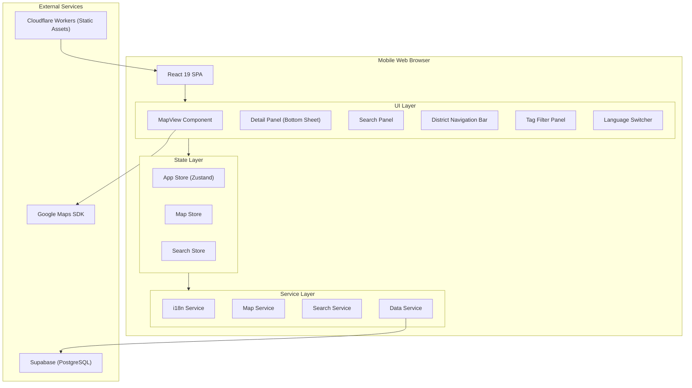
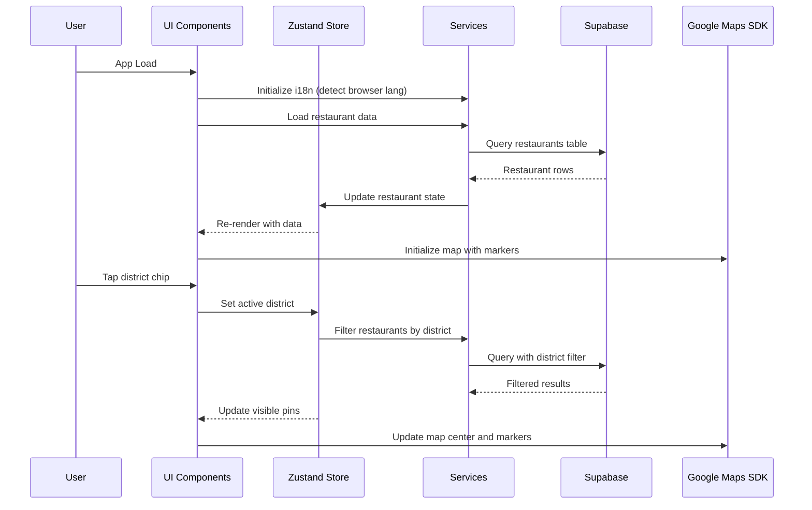

# Design Document: Foreign Foodie Map

## Overview

Foreign Foodie Map은 서울을 방문하는 외국인 관광객을 위한 모바일 웹 기반 맛집 디스커버리 애플리케이션이다. "구역 기반 탐색(District-First Exploration)" 컨셉으로, 사용자가 서울의 주요 관광 구역을 선택한 뒤 해당 구역 내 맛집을 자유롭게 탐색하는 경험을 제공한다.

### Key Design Decisions

1. **Single Page Application (SPA)**: React 19 + TypeScript 기반 SPA로 구현하여 빠른 인터랙션과 부드러운 전환 제공
2. **Google Maps SDK**: @vis.gl/react-google-maps 라이브러리를 사용하여 글로벌 사용자에게 친숙한 Google Maps 인터랙션 제공
3. **Supabase Backend**: 레스토랑 데이터를 Supabase PostgreSQL 테이블로 관리하고 Supabase Client SDK로 실시간 데이터 접근
4. **i18n with react-i18next**: 다국어 지원을 위해 검증된 react-i18next 라이브러리 사용
5. **Bottom Sheet Pattern**: 모바일 UX에 최적화된 바텀시트 패턴으로 상세 정보 및 검색 결과 표시
6. **Tailwind CSS**: 유틸리티 퍼스트 스타일링으로 빠른 개발과 일관된 디자인 시스템 구현
7. **motion.dev (Framer Motion)**: 바텀시트 전환, 패널 슬라이드, 칩 인터랙션에 부드러운 애니메이션 적용

### Technology Stack

| Layer | Technology | Rationale |
|-------|-----------|-----------|
| Framework | React 19 + TypeScript | 최신 React 기능 (use, Actions), 컴포넌트 기반 UI, 타입 안전성 |
| Build Tool | Vite | 빠른 빌드, 코드 스플리팅 지원 |
| Map SDK | @vis.gl/react-google-maps | React 친화적 Google Maps 래퍼, 글로벌 지도 데이터, 클러스터링 지원 |
| i18n | react-i18next | 동적 언어 전환, 네임스페이스 지원 |
| Styling | Tailwind CSS | 유틸리티 퍼스트, 빠른 프로토타이핑, 일관된 디자인 토큰 |
| Animation | motion.dev (Framer Motion) | 선언적 애니메이션, AnimatePresence, 제스처 지원 |
| State Management | Zustand | 경량 상태 관리, 보일러플레이트 최소화 |
| Backend | Supabase (PostgreSQL + Client SDK) | 실시간 데이터, Row Level Security, 자동 REST API |
| Testing | Vitest + fast-check | 단위 테스트 + 속성 기반 테스트 |
| Deployment | Cloudflare Workers (Static Assets) | 글로벌 엣지 배포, 빠른 응답 시간, wrangler CLI |

## Architecture

### High-Level Architecture



### Data Flow



## Components and Interfaces

### Component Hierarchy

```
App
├── Header
│   └── LanguageSwitcher
├── DistrictNavigationBar
│   └── DistrictChip[] (motion.div for tap animations)
├── MapContainer
│   ├── GoogleMap (@vis.gl/react-google-maps)
│   │   ├── AdvancedMarker[] (restaurant pins)
│   │   └── MarkerClusterer
│   └── TagFilterButton
├── TagFilterPanel (AnimatePresence overlay)
│   └── TagChip[] (motion.button)
├── SearchBar
│   └── AutocompleteDropdown (motion.div)
│       └── SuggestionItem[]
├── DetailPanel (motion.div bottom sheet)
│   ├── RestaurantHeader
│   ├── RatingDisplay
│   ├── TagBadges
│   ├── RestaurantInfo
│   └── RestaurantPhoto
└── SearchBottomSheet (motion.div)
    └── SearchResultItem[]
```

### Key Component Interfaces

```typescript
// LanguageSwitcher Component
interface LanguageSwitcherProps {
  currentLanguage: SupportedLanguage;
  onLanguageChange: (lang: SupportedLanguage) => void;
}

// DistrictNavigationBar Component
interface DistrictNavigationBarProps {
  districts: District[];
  activeDistrict: string | null;
  onDistrictSelect: (districtId: string | null) => void;
  language: SupportedLanguage;
}

// MapContainer Component
interface MapContainerProps {
  restaurants: Restaurant[];
  activeDistrict: string | null;
  selectedTags: string[];
  onPinClick: (restaurantId: string) => void;
  mapCenter: google.maps.LatLngLiteral;
  zoomLevel: number;
}

// DetailPanel Component (motion.div bottom sheet)
interface DetailPanelProps {
  restaurant: Restaurant | null;
  isOpen: boolean;
  onClose: () => void;
  language: SupportedLanguage;
}

// TagFilterPanel Component (AnimatePresence overlay)
interface TagFilterPanelProps {
  availableTags: Tag[];
  selectedTags: string[];
  matchingCount: number;
  onTagToggle: (tagId: string) => void;
  onApply: () => void;
  onClose: () => void;
  language: SupportedLanguage;
}

// SearchBar Component
interface SearchBarProps {
  query: string;
  onQueryChange: (query: string) => void;
  onSubmit: (query: string) => void;
  suggestions: SearchSuggestion[];
  onSuggestionSelect: (suggestion: SearchSuggestion) => void;
  language: SupportedLanguage;
}

// SearchBottomSheet Component (motion.div)
interface SearchBottomSheetProps {
  results: Restaurant[];
  isOpen: boolean;
  onClose: () => void;
  onResultSelect: (restaurantId: string) => void;
  query: string;
  language: SupportedLanguage;
}
```

### Service Interfaces

```typescript
// Data Service (Supabase)
interface DataService {
  loadRestaurants(districtId?: string): Promise<Restaurant[]>;
  getRestaurantById(id: string): Promise<Restaurant | undefined>;
  getDistricts(): Promise<District[]>;
  getRestaurantCountByDistrict(districtId: string): Promise<number>;
}

// Search Service
interface SearchService {
  search(query: string, language: SupportedLanguage): Promise<SearchResult>;
  getAutocompleteSuggestions(
    query: string,
    language: SupportedLanguage
  ): SearchSuggestion[];
  filterByTags(restaurants: Restaurant[], tags: string[]): Restaurant[];
}

// Map Service (Google Maps)
interface MapService {
  initializeMap(container: HTMLElement, options: MapOptions): google.maps.Map;
  setCenter(coordinates: google.maps.LatLngLiteral, zoomLevel?: number): void;
  addMarkers(restaurants: Restaurant[]): void;
  clearMarkers(): void;
  clusterMarkers(): void;
  highlightMarkers(restaurantIds: string[]): void;
  getViewportBounds(): google.maps.LatLngBounds | null;
}

// i18n Service
interface I18nService {
  detectBrowserLanguage(): SupportedLanguage;
  setLanguage(lang: SupportedLanguage): Promise<void>;
  getCurrentLanguage(): SupportedLanguage;
  t(key: string, options?: Record<string, unknown>): string;
}
```

### Store Interfaces

```typescript
// App Store (Zustand)
interface AppState {
  // Language
  language: SupportedLanguage;
  setLanguage: (lang: SupportedLanguage) => void;

  // Districts
  districts: District[];
  activeDistrict: string | null;
  setActiveDistrict: (districtId: string | null) => void;

  // Restaurants
  restaurants: Restaurant[];
  filteredRestaurants: Restaurant[];
  selectedRestaurant: Restaurant | null;
  setSelectedRestaurant: (restaurant: Restaurant | null) => void;

  // Tags
  availableTags: Tag[];
  selectedTags: string[];
  toggleTag: (tagId: string) => void;
  clearTags: () => void;
  isTagFilterOpen: boolean;
  setTagFilterOpen: (open: boolean) => void;

  // Search
  searchQuery: string;
  setSearchQuery: (query: string) => void;
  searchResults: Restaurant[];
  isSearchOpen: boolean;
  setSearchOpen: (open: boolean) => void;

  // UI State
  isDetailPanelOpen: boolean;
  isLoading: boolean;
}
```

### Animation Patterns (motion.dev)

```typescript
// Bottom Sheet animation variants
const bottomSheetVariants = {
  hidden: { y: '100%', opacity: 0 },
  visible: { y: 0, opacity: 1 },
  exit: { y: '100%', opacity: 0 },
};

// Tag Filter Panel overlay
const overlayVariants = {
  hidden: { opacity: 0 },
  visible: { opacity: 1 },
  exit: { opacity: 0 },
};

// District Chip tap animation
const chipTapVariants = {
  tap: { scale: 0.95 },
};

// Usage with motion components
// <motion.div
//   variants={bottomSheetVariants}
//   initial="hidden"
//   animate="visible"
//   exit="exit"
//   drag="y"
//   dragConstraints={{ top: 0 }}
//   onDragEnd={(_, info) => { if (info.offset.y > 100) onClose(); }}
//   transition={{ type: 'spring', damping: 25, stiffness: 300 }}
// />
```

## Data Models

### Core Data Types

```typescript
type SupportedLanguage = 'en' | 'ja' | 'zh';

interface LocalizedText {
  en: string;
  ja: string;
  zh: string;
}

interface District {
  id: string;
  name: LocalizedText;
  description: LocalizedText; // 구역 음식 문화 설명
  center: google.maps.LatLngLiteral;
  zoomLevel: number;
  boundary: google.maps.LatLngLiteral[]; // 구역 경계 폴리곤
}

interface Restaurant {
  id: string;
  name: LocalizedText;
  address: LocalizedText;
  district_id: string;
  coordinates: google.maps.LatLngLiteral;
  tags: string[];
  rating: number | null; // null if fewer than 3 ratings
  rating_count: number;
  operating_hours: LocalizedText;
  phone_number: string;
  photo_url: string;
  cuisine_type: LocalizedText;
}

interface Tag {
  id: string;
  label: LocalizedText;
  color: string; // Tailwind color class (e.g., 'bg-rose-100 text-rose-700')
  icon?: string; // optional icon identifier
}

interface SearchSuggestion {
  type: 'restaurant' | 'tag' | 'cuisine';
  id: string;
  label: LocalizedText;
  match_field: string; // which field matched
}

interface SearchResult {
  restaurants: Restaurant[];
  query: string;
  total_count: number;
}

interface MapOptions {
  center: google.maps.LatLngLiteral;
  zoom: number;
  minZoom: number;
  maxZoom: number;
  mapId: string; // Google Maps Map ID for styling
}
```

### Supabase Database Schema

```sql
-- Districts table
CREATE TABLE districts (
  id TEXT PRIMARY KEY,
  name_en TEXT NOT NULL,
  name_ja TEXT NOT NULL,
  name_zh TEXT NOT NULL,
  description_en TEXT NOT NULL,
  description_ja TEXT NOT NULL,
  description_zh TEXT NOT NULL,
  center_lat DOUBLE PRECISION NOT NULL,
  center_lng DOUBLE PRECISION NOT NULL,
  zoom_level INTEGER NOT NULL DEFAULT 15,
  boundary JSONB NOT NULL -- array of {lat, lng} objects
);

-- Tags table
CREATE TABLE tags (
  id TEXT PRIMARY KEY,
  label_en TEXT NOT NULL,
  label_ja TEXT NOT NULL,
  label_zh TEXT NOT NULL,
  color TEXT NOT NULL, -- Tailwind color class
  icon TEXT
);

-- Restaurants table
CREATE TABLE restaurants (
  id TEXT PRIMARY KEY,
  name_en TEXT NOT NULL,
  name_ja TEXT NOT NULL,
  name_zh TEXT NOT NULL,
  address_en TEXT NOT NULL,
  address_ja TEXT NOT NULL,
  address_zh TEXT NOT NULL,
  district_id TEXT NOT NULL REFERENCES districts(id),
  lat DOUBLE PRECISION NOT NULL,
  lng DOUBLE PRECISION NOT NULL,
  tags TEXT[] NOT NULL DEFAULT '{}',
  rating DOUBLE PRECISION,
  rating_count INTEGER NOT NULL DEFAULT 0,
  operating_hours_en TEXT,
  operating_hours_ja TEXT,
  operating_hours_zh TEXT,
  phone_number TEXT,
  photo_url TEXT,
  cuisine_type_en TEXT,
  cuisine_type_ja TEXT,
  cuisine_type_zh TEXT,
  created_at TIMESTAMPTZ NOT NULL DEFAULT NOW()
);

-- Index for district-based queries
CREATE INDEX idx_restaurants_district ON restaurants(district_id);

-- Index for tag-based filtering
CREATE INDEX idx_restaurants_tags ON restaurants USING GIN(tags);

-- Full-text search index (multilingual)
CREATE INDEX idx_restaurants_search ON restaurants USING GIN(
  to_tsvector('simple', name_en || ' ' || name_ja || ' ' || name_zh || ' ' ||
    cuisine_type_en || ' ' || cuisine_type_ja || ' ' || cuisine_type_zh)
);
```

### Supabase Client Integration

```typescript
import { createClient } from '@supabase/supabase-js';

const supabase = createClient(
  import.meta.env.VITE_SUPABASE_URL,
  import.meta.env.VITE_SUPABASE_ANON_KEY
);

// Example: Load restaurants by district
async function loadRestaurants(districtId?: string): Promise<Restaurant[]> {
  let query = supabase.from('restaurants').select('*');
  if (districtId) {
    query = query.eq('district_id', districtId);
  }
  const { data, error } = await query;
  if (error) throw error;
  return data.map(mapRowToRestaurant);
}

// Example: Search restaurants
async function searchRestaurants(
  searchQuery: string
): Promise<Restaurant[]> {
  const { data, error } = await supabase
    .from('restaurants')
    .select('*')
    .or(
      `name_en.ilike.%${searchQuery}%,` +
      `name_ja.ilike.%${searchQuery}%,` +
      `name_zh.ilike.%${searchQuery}%,` +
      `cuisine_type_en.ilike.%${searchQuery}%,` +
      `cuisine_type_ja.ilike.%${searchQuery}%,` +
      `cuisine_type_zh.ilike.%${searchQuery}%`
    );
  if (error) throw error;
  return data.map(mapRowToRestaurant);
}
```

### Sample Data (Supabase Row)

```json
{
  "id": "rest-001",
  "name_en": "Gogung",
  "name_ja": "古宮",
  "name_zh": "古宫",
  "address_en": "15 Myeongdong-gil, Jung-gu, Seoul",
  "address_ja": "ソウル市中区明洞キル15",
  "address_zh": "首尔市中区明洞路15号",
  "district_id": "myeongdong",
  "lat": 37.5635,
  "lng": 126.985,
  "tags": ["delicious", "great-atmosphere"],
  "rating": 4.3,
  "rating_count": 128,
  "operating_hours_en": "11:00 AM - 10:00 PM",
  "operating_hours_ja": "11:00 - 22:00",
  "operating_hours_zh": "11:00 - 22:00",
  "phone_number": "+82-2-776-3211",
  "photo_url": "https://supabase-storage.example.com/photos/rest-001.jpg",
  "cuisine_type_en": "Korean BBQ",
  "cuisine_type_ja": "韓国BBQ",
  "cuisine_type_zh": "韩国烤肉"
}
```

## Correctness Properties

*A property is a characteristic or behavior that should hold true across all valid executions of a system — essentially, a formal statement about what the system should do. Properties serve as the bridge between human-readable specifications and machine-verifiable correctness guarantees.*

### Property 1: Localization consistency

*For any* LocalizedText object (restaurant name, address, tag label, district name, or district description) and *for any* supported language selection, accessing the text with that language key should return a non-empty string in the expected language, and switching languages should consistently resolve all displayed text to the newly selected language.

**Validates: Requirements 1.2, 3.2, 5.2, 6.3, 9.2**

### Property 2: Language preference round-trip

*For any* supported language, persisting the language preference to local storage and then reading it back should return the same language value that was stored.

**Validates: Requirements 1.3**

### Property 3: Browser language detection mapping

*For any* browser language string, the language detection function should always return a valid SupportedLanguage ('en', 'ja', or 'zh'). For browser language strings that start with 'ja', the result should be 'ja'. For strings starting with 'zh', the result should be 'zh'. For all other strings (including 'en' and unrecognized languages), the result should be 'en'.

**Validates: Requirements 1.4, 1.5**

### Property 4: Viewport-based pin filtering

*For any* set of restaurants and *for any* rectangular viewport defined by latitude/longitude bounds, the set of rendered restaurant pins should contain exactly those restaurants whose coordinates fall within the viewport bounds.

**Validates: Requirements 2.2, 2.3**

### Property 5: Marker clustering correctness

*For any* set of restaurant coordinates at a given zoom level, when multiple restaurants are within the clustering distance threshold, they should be grouped into a single cluster marker whose displayed count equals the number of restaurants in that cluster.

**Validates: Requirements 2.5**

### Property 6: Detail panel completeness

*For any* valid Restaurant object, the detail panel should display the restaurant name, address, star rating (or "New" label), all associated tags, photo (or placeholder), operating hours, and phone number. If any field is null or empty, a placeholder should be shown rather than omitting the field.

**Validates: Requirements 3.1, 3.4, 5.3**

### Property 7: Rating display rules

*For any* restaurant, if rating_count >= 3 then the display should show the numeric rating (between 1.0 and 5.0) alongside the rating count. If rating_count < 3, the display should show "New" instead of a numeric rating. The numeric rating should never be displayed when rating_count < 3, and "New" should never be displayed when rating_count >= 3.

**Validates: Requirements 4.1, 4.3, 4.4**

### Property 8: Tag filter intersection semantics

*For any* set of restaurants and *for any* subset of selected tags, the filtered result should contain exactly those restaurants whose tag set is a superset of the selected tags (AND logic). The count of matching restaurants displayed in the Tag_Filter_Panel should equal the length of this filtered result.

**Validates: Requirements 5.5, 5.7**

### Property 9: District filter correctness

*For any* district selection, the set of visible restaurants should contain exactly those restaurants whose district_id matches the selected district. The restaurant count displayed on the district chip should equal the total number of restaurants with that district_id.

**Validates: Requirements 6.2, 6.4**

### Property 10: Search matching completeness

*For any* restaurant and *for any* substring of its name, cuisine type, or tag labels (in any supported language), searching for that substring should include that restaurant in the search results. Conversely, restaurants that do not match the query in any of these fields should not appear in results.

**Validates: Requirements 7.1, 7.2**

### Property 11: Autocomplete relevance

*For any* non-empty query prefix, the autocomplete suggestions should only contain items (restaurants, tags, or cuisine types) whose labels contain the query prefix as a substring in the currently selected language. No suggestion should be returned that does not match the query.

**Validates: Requirements 7.3**

### Property 12: Non-ranked restaurant order

*For any* district with multiple restaurants, the order of restaurants displayed should not be sorted by rating value (ascending or descending). Specifically, the Spearman rank correlation between display position and rating should not be statistically significant.

**Validates: Requirements 9.1, 9.4**

### Property 13: District empty state handling

*For any* district, if the number of restaurants with that district_id is zero, the map should display an empty state message and render zero pins. If the count is greater than zero, all restaurants should be rendered as pins and no empty state message should be shown.

**Validates: Requirements 9.3**

## Error Handling

### Error Categories and Strategies

| Error Type | Scenario | Strategy | User Impact |
|-----------|----------|----------|-------------|
| Network Failure | Supabase query fails | Show cached data if available, otherwise display error state with retry button | Graceful degradation |
| Map SDK Error | Google Maps fails to load | Display static fallback with restaurant list view | Functional alternative |
| Missing Data | Restaurant field is null/undefined | Show placeholder text/image | No broken UI |
| Language Load Failure | Translation file fails to load | Fall back to English, show loading indicator | Minimal disruption |
| Search Error | Supabase search query throws | Display "Search unavailable" message | Clear feedback |
| Geolocation Error | Browser denies location access | Default to Seoul center, no location features | App still functional |
| Supabase Auth Error | Anon key invalid or expired | Display connection error with retry | Clear feedback |

### Error Handling Patterns

```typescript
// Graceful degradation for data loading
interface LoadingState<T> {
  status: 'idle' | 'loading' | 'success' | 'error';
  data: T | null;
  error: string | null;
}

// Retry mechanism for Supabase requests
interface RetryConfig {
  maxRetries: number;      // default: 3
  backoffMs: number;       // default: 1000
  backoffMultiplier: number; // default: 2
}

// Error boundary for component-level failures
interface ErrorBoundaryProps {
  fallback: React.ReactNode;
  onError?: (error: Error, errorInfo: React.ErrorInfo) => void;
}
```

### Specific Error Scenarios

1. **Detail Panel with missing data (Req 3.1)**: If restaurant data is partially loaded, the panel still opens and shows available fields with Tailwind-styled placeholders (e.g., `bg-gray-200 animate-pulse rounded`) for missing ones.

2. **Language switch timeout (Req 1.2)**: If language switch takes > 1 second, show a subtle loading spinner on the language switcher without blocking map interaction.

3. **Map highlighting failure (Req 7.4)**: If Google Maps pin highlighting fails during search, the Search_Bottom_Sheet still displays results with a notice that map view is temporarily unavailable.

4. **District data load failure (Req 9.3)**: If Supabase query for a district fails, display an empty state message explaining the issue rather than showing stale or incorrect pins.

5. **Tag filter with no matches (Req 5.7)**: Display "0 restaurants" count and disable the "Show Results" button with `opacity-50 cursor-not-allowed` styling.

6. **Supabase connection failure**: Cache last successful data in localStorage as fallback. Show a subtle banner indicating offline mode with `bg-amber-50 text-amber-800` styling.

## Testing Strategy

### Testing Approach

This project uses a dual testing approach:
- **Property-based tests** verify universal correctness properties across randomized inputs
- **Unit tests** verify specific examples, edge cases, and integration points
- **Integration tests** verify Google Maps SDK interaction and Supabase data fetching

### Property-Based Testing Configuration

- **Library**: fast-check (TypeScript property-based testing library)
- **Minimum iterations**: 100 per property test
- **Tag format**: `Feature: foreign-foodie-map, Property {number}: {property_text}`

Each correctness property (Properties 1-13) will be implemented as a single property-based test using fast-check arbitraries to generate:
- Random `LocalizedText` objects with strings in each language
- Random `Restaurant` objects with valid field ranges
- Random `SupportedLanguage` selections
- Random tag subsets from the available tag pool
- Random viewport bounds (lat/lng rectangles)
- Random search query strings

### Unit Test Coverage

Unit tests focus on:
- Component rendering (LanguageSwitcher options, DistrictChip Tailwind classes, TagBadge colors)
- UI interactions (bottom sheet open/close via motion.dev, district chip toggle, tag selection)
- Edge cases (empty search results message, "New" rating label, missing photo placeholder)
- Integration points (Google Maps SDK initialization, Supabase client mocking)
- Animation states (motion.div variants, AnimatePresence exit animations)

### Test File Structure

```
src/
├── services/
│   ├── __tests__/
│   │   ├── search.service.test.ts        # Unit tests
│   │   ├── search.service.property.test.ts # Property tests (Props 10, 11)
│   │   ├── i18n.service.test.ts
│   │   ├── i18n.service.property.test.ts  # Property tests (Props 1, 2, 3)
│   │   ├── data.service.test.ts
│   │   └── data.service.property.test.ts  # Property tests (Props 4, 9, 13)
│   └── ...
├── components/
│   ├── __tests__/
│   │   ├── DetailPanel.test.tsx           # Unit tests
│   │   ├── DetailPanel.property.test.ts   # Property tests (Props 6, 7)
│   │   ├── TagFilterPanel.test.tsx
│   │   ├── TagFilterPanel.property.test.ts # Property test (Prop 8)
│   │   ├── MapContainer.test.tsx
│   │   └── MapContainer.property.test.ts  # Property test (Prop 5)
│   └── ...
└── utils/
    ├── __tests__/
    │   ├── filter.utils.test.ts
    │   ├── filter.utils.property.test.ts  # Property tests (Props 8, 9, 12)
    │   └── rating.utils.property.test.ts  # Property test (Prop 7)
    └── ...
```

### Deployment Configuration (Cloudflare Workers with Static Assets)

```toml
# wrangler.toml
name = "foreign-foodie-map"
compatibility_date = "2025-05-26"
main = "src/worker.ts"

[assets]
directory = "./dist"

[vars]
VITE_SUPABASE_URL = ""
VITE_SUPABASE_ANON_KEY = ""
VITE_GOOGLE_MAPS_API_KEY = ""
```

```typescript
// src/worker.ts
export default {
  async fetch(request: Request, env: Env): Promise<Response> {
    // Static assets are served automatically via [assets] config
    // This worker handles any additional API routes if needed
    return new Response('Not Found', { status: 404 });
  },
};
```

### Performance Testing

- Lighthouse CI for initial load time verification (< 3 seconds on 4G)
- Bundle size monitoring with size-limit
- Map rendering performance with 100+ markers using Google Maps MarkerClusterer
- Supabase query response time monitoring

### Accessibility Testing

- axe-core integration for automated a11y checks
- Screen reader testing for language switcher and navigation
- Touch target size verification (minimum 44x44px)
- Tailwind focus-visible utilities for keyboard navigation
