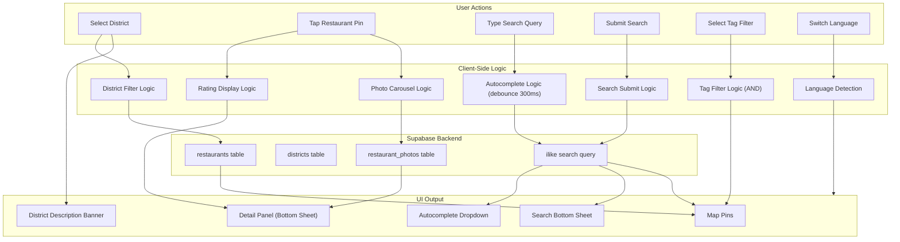

# Business Logic Model - matzip-map

## Data Flow Overview



## Core Business Flows

### Flow 1: App Initialization

```
1. Check localStorage for saved language preference
2. IF saved language exists → use it
   ELSE → detect browser language → map to SupportedLanguage
3. Load i18n translations for selected language
4. Fetch districts from Supabase
5. Render initial screen:
   - Map centered on Seoul (zoom 11-12)
   - District_Navigation_Bar with district chips
   - No restaurant pins
   - Search bar at top
```

### Flow 2: District Selection

```
1. User taps district chip
2. IF same district already selected → deselect, return to initial state
   ELSE:
   a. Set activeDistrict in store
   b. Fetch restaurants WHERE district_id = selected district
   c. Animate map center to district.center_lat/lng
   d. Set zoom to district.zoom_level
   e. Render restaurant pins on map
   f. Display district food culture description (animated banner)
   g. Update district chip: highlight + show restaurant count
```

### Flow 3: Restaurant Detail View

```
1. User taps Restaurant_Pin
2. Fetch restaurant_photos WHERE restaurant_id = tapped restaurant
3. Open Detail_Panel (bottom sheet, spring animation from bottom)
4. Display:
   - Restaurant name (current language)
   - Address (current language)
   - Rating (apply BR-1 rules)
   - Tags (colored badges)
   - Photo carousel (apply BR-8 rules)
   - Operating hours
   - Phone number
5. Handle missing data per BR-9
```

### Flow 4: Tag Filtering

```
1. User taps tag filter button on map
2. Open Tag_Filter_Panel (overlay, fade-in animation)
3. Display all predefined tags as selectable chips
4. On each tag toggle:
   a. Update selectedTags in store
   b. Apply AND filter logic (BR-3)
   c. Update matching count in real-time
5. User taps "Show Results":
   a. Close Tag_Filter_Panel
   b. Update map pins to show only matching restaurants
   c. IF matching count = 0 → show empty state
```

### Flow 5: Search (Autocomplete)

```
1. User types in search input
2. Debounce 300ms
3. Query Supabase:
   - ilike match on name_{lang}, cuisine_type_{lang}
   - Also match against tag labels
4. Return max 10 suggestions
5. Display in Autocomplete_Dropdown (animated slide-down)
6. On suggestion tap:
   - IF type = 'restaurant' → center map on restaurant, open Detail_Panel
   - IF type = 'tag' → apply tag filter
   - IF type = 'cuisine' → submit as search query
```

### Flow 6: Search (Submit)

```
1. User submits search query (enter key or search button)
2. Close Autocomplete_Dropdown
3. Query Supabase for full results
4. Open Search_Bottom_Sheet (spring animation from bottom)
5. Display results list
6. Highlight matching pins on map
7. IF map highlight fails → show notice in bottom sheet
8. IF no results → show "No results found" message
9. On result item tap → center map on restaurant, open Detail_Panel
```

### Flow 7: Language Switch

```
1. User taps Language_Switcher
2. Show language options (EN / JA / ZH)
3. On selection:
   a. Save to localStorage
   b. Update i18n language
   c. Re-render all UI text
   d. IF switch takes > 1s → show loading indicator (non-blocking)
   e. Update all visible content:
      - District names in navigation bar
      - District description (if visible)
      - Detail Panel content (if open)
      - Search results (if visible)
      - Tag labels
```

## Supabase Query Patterns

### District Restaurants Query (with translations)
```sql
SELECT r.*, 
  json_object_agg(rt.field_name, rt.value) as translations
FROM restaurants r
LEFT JOIN restaurant_translations rt 
  ON rt.restaurant_id = r.id AND rt.lang = :lang
WHERE r.district_id = :districtId
GROUP BY r.id
ORDER BY r.created_at;
```

### Search Query (Autocomplete via translation table)
```sql
SELECT DISTINCT r.*,
  json_object_agg(rt.field_name, rt.value) as translations
FROM restaurants r
JOIN restaurant_translations rt 
  ON rt.restaurant_id = r.id 
  AND rt.lang = :lang
  AND rt.field_name IN ('name', 'cuisine_type')
  AND rt.value ILIKE '%' || :query || '%'
GROUP BY r.id
LIMIT 10;
```

### Restaurant Photos Query
```sql
SELECT p.*, pt.value as alt_text
FROM restaurant_photos p
LEFT JOIN restaurant_photo_translations pt
  ON pt.photo_id = p.id AND pt.lang = :lang AND pt.field_name = 'alt_text'
WHERE p.restaurant_id = :restaurantId
ORDER BY p.display_order ASC;
```

### District with Translations
```sql
SELECT d.*,
  json_object_agg(dt.field_name, dt.value) as translations
FROM districts d
LEFT JOIN district_translations dt 
  ON dt.district_id = d.id AND dt.lang = :lang
GROUP BY d.id;
```

### District Restaurant Count
```sql
SELECT district_id, COUNT(*) as count
FROM restaurants
GROUP BY district_id;
```
