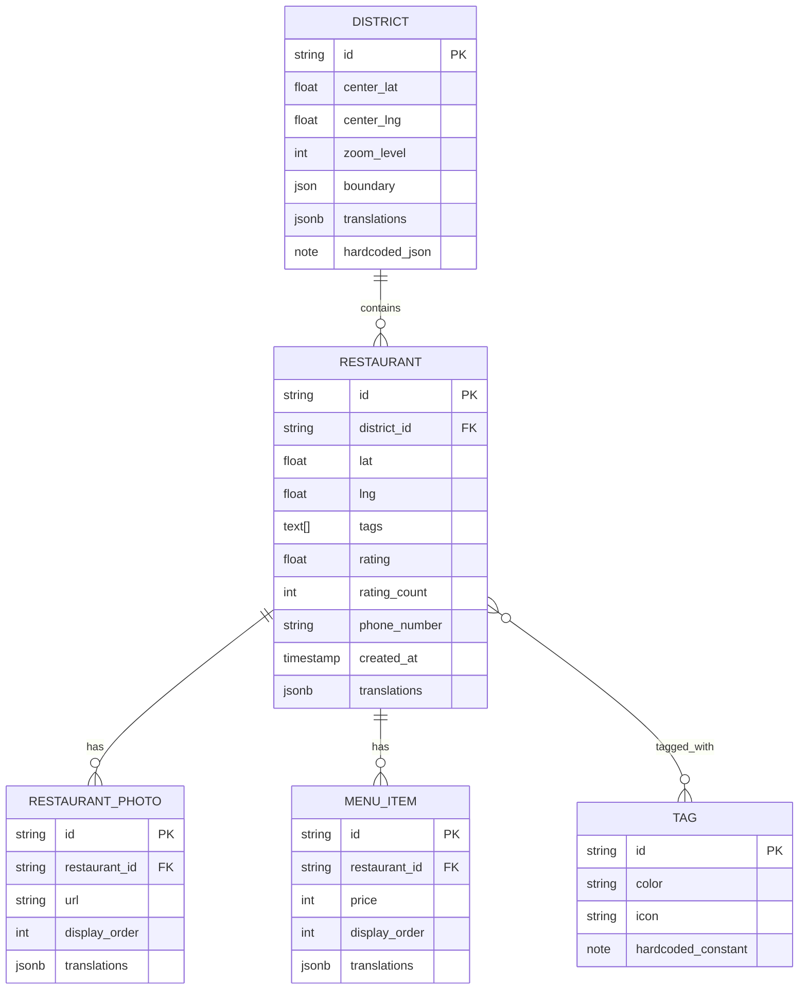

# Domain Entities - matzip-map

## Entity Relationship Diagram



## Translation Pattern

각 엔티티 테이블에 `translations` JSONB 컬럼 하나를 두고, 필드명 → 언어 → 값 구조로 번역을 저장한다. JOIN 없이 단일 쿼리로 모든 번역 데이터에 접근 가능.

### translations 컬럼 구조

```json
{
  "field_name": {
    "en": "English value",
    "ja": "日本語の値",
    "zh": "中文值"
  },
  "another_field": {
    "en": "...",
    "ja": "...",
    "zh": "..."
  }
}
```

### 예시: Restaurant translations 컬럼

```json
{
  "name": {
    "en": "Gogung",
    "ja": "古宮",
    "zh": "古宫"
  },
  "address": {
    "en": "15 Myeongdong-gil, Jung-gu, Seoul",
    "ja": "ソウル市中区明洞キル15",
    "zh": "首尔市中区明洞路15号"
  },
  "operating_hours": {
    "en": "11:00 AM - 10:00 PM",
    "ja": "11:00 - 22:00",
    "zh": "11:00 - 22:00"
  },
  "cuisine_type": {
    "en": "Korean BBQ",
    "ja": "韓国BBQ",
    "zh": "韩国烤肉"
  }
}
```

### 예시: District translations 컬럼

```json
{
  "name": {
    "en": "Myeongdong",
    "ja": "明洞",
    "zh": "明洞"
  },
  "description": {
    "en": "Famous for Korean BBQ, street food, and traditional cuisine",
    "ja": "韓国BBQ、屋台料理、伝統料理で有名",
    "zh": "以韩国烤肉、街头小吃和传统美食闻名"
  }
}
```

## Entity Descriptions

### District (구역) — 하드코딩 (JSON 상수)
서울 내 관광 구역 단위. DB 테이블 없이 코드에 JSON으로 하드코딩한다.

| Field | Type | Description |
|-------|------|-------------|
| id | string | 고유 식별자 (예: "myeongdong", "seongsu") |
| center_lat, center_lng | float | 구역 중심 좌표 |
| zoom_level | int | 구역 선택 시 지도 줌 레벨 |
| boundary | json | 폴리곤 좌표 배열 [{lat, lng}, ...] |
| translations | object | 번역 데이터 (name, description) |

```typescript
export const DISTRICTS: District[] = [
  {
    id: '57c50c10-198d-48ec-8255-4c45b8f7bc9e',
    center_lat: 37.5636,
    center_lng: 126.9869,
    zoom_level: 15,
    boundary: [/* polygon coordinates */],
    translations: {
      name: { en: 'Myeongdong', ja: '明洞', zh: '明洞' },
      description: {
        en: 'Famous for Korean BBQ, street food, and traditional cuisine',
        ja: '韓国BBQ、屋台料理、伝統料理で有名',
        zh: '以韩国烤肉、街头小吃和传统美食闻名',
      },
    },
  },
  {
    id: '7331f511-c521-4382-a1e3-ffcc639d10b7',
    center_lat: 37.5447,
    center_lng: 127.0557,
    zoom_level: 15,
    boundary: [],
    translations: {
      name: { en: 'Seongsu', ja: '聖水', zh: '圣水' },
      description: {
        en: 'Trendy cafes, fusion restaurants, and creative dining',
        ja: 'トレンディなカフェ、フュージョンレストラン',
        zh: '时尚咖啡馆、融合餐厅和创意美食',
      },
    },
  },
  {
    id: '32c525cc-da0f-4445-b93e-b7509e25334a',
    center_lat: 37.4979,
    center_lng: 127.0276,
    zoom_level: 15,
    boundary: [],
    translations: {
      name: { en: 'Gangnam', ja: '江南', zh: '江南' },
      description: {
        en: 'Upscale dining, international cuisine, and fine restaurants',
        ja: '高級レストラン、各国料理、ファインダイニング',
        zh: '高档餐饮、国际美食和精致餐厅',
      },
    },
  },
  {
    id: '1b551ff6-517f-4c0e-8117-001468102ee4',
    center_lat: 37.5165,
    center_lng: 127.0205,
    zoom_level: 15,
    boundary: [],
    translations: {
      name: { en: 'Sinsa', ja: '新沙', zh: '新沙' },
      description: {
        en: 'Garosu-gil area with stylish cafes and brunch spots',
        ja: 'カロスキルエリア、スタイリッシュなカフェとブランチ',
        zh: '林荫路地区，时尚咖啡馆和早午餐',
      },
    },
  },
  {
    id: 'e20519ea-418d-4c8e-b4c4-2ecdd9c0b93a',
    center_lat: 37.5547,
    center_lng: 126.9707,
    zoom_level: 15,
    boundary: [],
    translations: {
      name: { en: 'Seoul Station', ja: 'ソウル駅', zh: '首尔站' },
      description: {
        en: 'Quick eats, traditional Korean food near the transit hub',
        ja: '交通ハブ近くの韓国伝統料理とクイックフード',
        zh: '交通枢纽附近的传统韩国料理和快餐',
      },
    },
  },
  {
    id: 'dc4fe1d1-ae06-4697-8abb-1c6bad668c69',
    center_lat: 37.5116,
    center_lng: 127.0595,
    zoom_level: 15,
    boundary: [],
    translations: {
      name: { en: 'COEX/Samsung Station', ja: 'COEX/三成駅', zh: 'COEX/三成站' },
      description: {
        en: 'Mall dining, business lunch spots, and diverse food courts',
        ja: 'モールダイニング、ビジネスランチ、多様なフードコート',
        zh: '商场餐饮、商务午餐和多样化美食广场',
      },
    },
  },
];
```

### Restaurant (맛집)
맛집 정보. Supabase에서 수동 관리한다.

| Field | Type | Description |
|-------|------|-------------|
| id | string | 고유 식별자 |
| district_id | string FK | 소속 구역 |
| lat, lng | float | 위치 좌표 |
| tags | text[] | 태그 ID 배열 |
| rating | float | 별점 (1.0~5.0, null if < 3 ratings) |
| rating_count | int | 평가 수 |
| phone_number | string | 전화번호 |
| created_at | timestamp | 생성일시 |
| translations | jsonb | 번역 데이터 (name, address, operating_hours, cuisine_type) |

### Restaurant_Photo (맛집 사진)
맛집별 여러 장의 사진을 관리한다. 캐러셀 표시를 위해 display_order로 순서를 지정한다.

| Field | Type | Description |
|-------|------|-------------|
| id | string | 고유 식별자 |
| restaurant_id | string FK | 소속 맛집 |
| url | string | 사진 URL (Supabase Storage) |
| display_order | int | 캐러셀 표시 순서 |
| translations | jsonb | 번역 데이터 (alt_text) |

### Menu_Item (메뉴)
레스토랑별 메뉴 항목. 이름과 가격 정보를 관리한다.

| Field | Type | Description |
|-------|------|-------------|
| id | string | 고유 식별자 |
| restaurant_id | string FK | 소속 맛집 |
| price | int | 가격 (원 단위) |
| display_order | int | 표시 순서 |
| translations | jsonb | 번역 데이터 (name) |

**translations 예시:**
```json
{
  "name": {
    "en": "Bibimbap",
    "ja": "ビビンバ",
    "zh": "拌饭"
  }
}
```

### Tag (태그)
맛집 특성 분류 태그. 코드에 상수로 하드코딩하되, 배열/객체 형태로 관리하여 추가/삭제가 용이하도록 한다.

| Field | Type | Description |
|-------|------|-------------|
| id | string | 고유 식별자 (예: "delicious", "great-atmosphere") |
| color | string | Tailwind 색상 클래스 |
| icon | string | 아이콘 식별자 (optional) |

**태그 라벨은 하드코딩** (DB 불필요 — 코드 상수로 관리):

```typescript
export const TAGS: Tag[] = [
  { id: 'delicious', label: { en: 'Delicious', ja: '美味しい', zh: '好吃' }, color: 'bg-red-100 text-red-700', icon: '🔥' },
  { id: 'great-atmosphere', label: { en: 'Great Atmosphere', ja: '雰囲気◎', zh: '氛围好' }, color: 'bg-purple-100 text-purple-700', icon: '✨' },
  { id: 'good-value', label: { en: 'Good Value', ja: 'コスパ◎', zh: '性价比高' }, color: 'bg-green-100 text-green-700', icon: '💰' },
  { id: 'japanese-menu', label: { en: 'Japanese Menu', ja: '日本語メニュー', zh: '日语菜单' }, color: 'bg-blue-100 text-blue-700', icon: '🇯🇵' },
  { id: 'chinese-menu', label: { en: 'Chinese Menu', ja: '中国語メニュー', zh: '中文菜单' }, color: 'bg-amber-100 text-amber-700', icon: '🇨🇳' },
];
```

## Supabase Database Schema

```sql
-- Restaurants table (only DB-managed entity)
CREATE TABLE restaurants (
  id TEXT PRIMARY KEY,
  district_id TEXT NOT NULL,
  lat DOUBLE PRECISION NOT NULL,
  lng DOUBLE PRECISION NOT NULL,
  tags TEXT[] NOT NULL DEFAULT '{}',
  rating DOUBLE PRECISION,
  rating_count INTEGER NOT NULL DEFAULT 0,
  phone_number TEXT,
  created_at TIMESTAMPTZ NOT NULL DEFAULT NOW(),
  translations JSONB NOT NULL DEFAULT '{}'
);

-- Restaurant photos
CREATE TABLE restaurant_photos (
  id TEXT PRIMARY KEY,
  restaurant_id TEXT NOT NULL REFERENCES restaurants(id) ON DELETE CASCADE,
  url TEXT NOT NULL,
  display_order INTEGER NOT NULL DEFAULT 0,
  translations JSONB NOT NULL DEFAULT '{}'
);

-- Menu items
CREATE TABLE menu_items (
  id TEXT PRIMARY KEY,
  restaurant_id TEXT NOT NULL REFERENCES restaurants(id) ON DELETE CASCADE,
  price INTEGER NOT NULL,
  display_order INTEGER NOT NULL DEFAULT 0,
  translations JSONB NOT NULL DEFAULT '{}'
);

-- Indexes
CREATE INDEX idx_restaurants_district ON restaurants(district_id);
CREATE INDEX idx_restaurants_tags ON restaurants USING GIN(tags);
CREATE INDEX idx_restaurants_translations ON restaurants USING GIN(translations);
CREATE INDEX idx_menu_items_restaurant ON menu_items(restaurant_id);
```

## Query Patterns

### Fetch districts (하드코딩, DB 쿼리 불필요)
```typescript
import { DISTRICTS } from '@/constants/districts';
// 클라이언트에서 직접 접근: DISTRICTS.find(d => d.id === districtId)
```

### Fetch restaurants by district (no JOIN needed)
```sql
SELECT * FROM restaurants
WHERE district_id = :districtId
ORDER BY created_at;
```

클라이언트에서 `row.translations.name[lang]`으로 현재 언어 값 접근.

### Search by translated fields (JSONB operator)
```sql
SELECT * FROM restaurants
WHERE translations->'name'->>:lang ILIKE '%' || :query || '%'
   OR translations->'cuisine_type'->>:lang ILIKE '%' || :query || '%'
LIMIT 10;
```

### Fetch restaurant photos (no JOIN needed)
```sql
SELECT * FROM restaurant_photos
WHERE restaurant_id = :restaurantId
ORDER BY display_order ASC;
```

클라이언트에서 `row.translations.alt_text[lang]` 접근.

### Fetch menu items (no JOIN needed)
```sql
SELECT * FROM menu_items
WHERE restaurant_id = :restaurantId
ORDER BY display_order ASC;
```

클라이언트에서 `row.translations.name[lang]` + `row.price` 접근.

### District restaurant count
```sql
SELECT district_id, COUNT(*) as count
FROM restaurants
GROUP BY district_id;
```

## TypeScript Types

```typescript
type SupportedLanguage = 'en' | 'ja' | 'zh';

// Generic translation map: { field_name: { lang: value } }
type TranslationMap = Record<string, Record<SupportedLanguage, string>>;

// Helper to extract translated value
function t(translations: TranslationMap, field: string, lang: SupportedLanguage): string {
  return translations?.[field]?.[lang] ?? translations?.[field]?.['en'] ?? '';
}

interface District {
  id: string;
  center_lat: number;
  center_lng: number;
  zoom_level: number;
  boundary: google.maps.LatLngLiteral[];
  translations: TranslationMap;
}

interface Restaurant {
  id: string;
  district_id: string;
  lat: number;
  lng: number;
  tags: string[];
  rating: number | null;
  rating_count: number;
  phone_number: string | null;
  created_at: string;
  translations: TranslationMap;
}

interface RestaurantPhoto {
  id: string;
  restaurant_id: string;
  url: string;
  display_order: number;
  translations: TranslationMap; // { alt_text }
}

interface MenuItem {
  id: string;
  restaurant_id: string;
  price: number; // KRW
  display_order: number;
  translations: TranslationMap; // { name }
}
```

## 장점

- **JOIN 불필요**: 단일 테이블 쿼리로 번역 포함 데이터 조회
- **스키마 변경 없이 언어 추가**: JSONB에 새 언어 키만 추가
- **스키마 변경 없이 필드 추가**: JSONB에 새 필드명 키만 추가
- **Supabase 대시보드에서 직접 편집 용이**: JSON 에디터로 번역 관리
- **클라이언트 로직 단순화**: `translations[field][lang]`으로 일관된 접근
