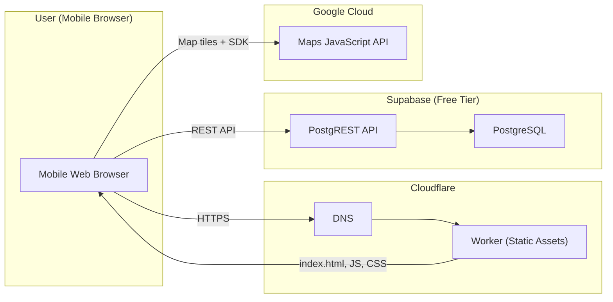

# Infrastructure Design - matzip-map

## Infrastructure Overview



## Service Mapping

| Service | Provider | Tier | Purpose |
|---------|----------|------|---------|
| Frontend Hosting | Cloudflare Workers | Free (100K req/day) | SPA 정적 파일 서빙 |
| DNS | Cloudflare | Free | 도메인 관리 + 프록시 |
| Database | Supabase PostgreSQL | Free (500MB) | 레스토랑, 사진 URL, 메뉴 데이터 |
| Map | Google Maps Platform | Free ($200/month credit) | 지도 렌더링 |

## Cloudflare Workers Configuration

### wrangler.toml
```toml
name = "matzip-map"
compatibility_date = "2025-05-26"
main = "src/worker.ts"

[assets]
directory = "./dist"
```

### Worker Entry Point (src/worker.ts)
```typescript
export default {
  async fetch(request: Request, env: Env): Promise<Response> {
    // Static assets are served automatically via [assets] config
    // Worker handles SPA fallback for client-side routing
    return new Response(null, { status: 404 });
  },
};
```

### 배포 명령
```bash
# 빌드
pnpm build

# 배포
pnpm exec wrangler deploy
```

## Supabase Configuration

### Project Setup
- Region: Northeast Asia (ap-northeast-2) — 한국 사용자 최적
- Plan: Free tier

### Database Tables
```sql
-- restaurants
CREATE TABLE restaurants (
  id TEXT PRIMARY KEY,
  district_id TEXT NOT NULL,
  lat DOUBLE PRECISION NOT NULL,
  lng DOUBLE PRECISION NOT NULL,
  tags TEXT[] NOT NULL DEFAULT '{}',
  rating DOUBLE PRECISION,
  rating_count INTEGER NOT NULL DEFAULT 0,
  phone_number TEXT,
  created_at TIMESTAMPTZ NOT NULL DEFAULT NOW(),
  translations JSONB NOT NULL DEFAULT '{}'
);

-- restaurant_photos
CREATE TABLE restaurant_photos (
  id TEXT PRIMARY KEY,
  restaurant_id TEXT NOT NULL REFERENCES restaurants(id) ON DELETE CASCADE,
  url TEXT NOT NULL,
  display_order INTEGER NOT NULL DEFAULT 0,
  translations JSONB NOT NULL DEFAULT '{}'
);

-- menu_items
CREATE TABLE menu_items (
  id TEXT PRIMARY KEY,
  restaurant_id TEXT NOT NULL REFERENCES restaurants(id) ON DELETE CASCADE,
  price INTEGER NOT NULL,
  display_order INTEGER NOT NULL DEFAULT 0,
  translations JSONB NOT NULL DEFAULT '{}'
);

-- Indexes
CREATE INDEX idx_restaurants_district ON restaurants(district_id);
CREATE INDEX idx_restaurants_tags ON restaurants USING GIN(tags);
CREATE INDEX idx_restaurants_translations ON restaurants USING GIN(translations);
CREATE INDEX idx_menu_items_restaurant ON menu_items(restaurant_id);
CREATE INDEX idx_photos_restaurant ON restaurant_photos(restaurant_id);
```

### Row Level Security
```sql
ALTER TABLE restaurants ENABLE ROW LEVEL SECURITY;
CREATE POLICY "Public read" ON restaurants FOR SELECT USING (true);

ALTER TABLE restaurant_photos ENABLE ROW LEVEL SECURITY;
CREATE POLICY "Public read" ON restaurant_photos FOR SELECT USING (true);

ALTER TABLE menu_items ENABLE ROW LEVEL SECURITY;
CREATE POLICY "Public read" ON menu_items FOR SELECT USING (true);
```

### Photo Storage Strategy
```
사진은 외부 이미지 URL을 restaurant_photos 테이블의 url 컬럼에 직접 저장합니다.
별도 파일 스토리지 서비스를 사용하지 않아 운영 비용을 절감합니다.
이미지는 외부 CDN(Google Places 등)에서 직접 서빙됩니다.
```

## Google Maps Configuration

### API 설정
- API: Maps JavaScript API 활성화
- Key restrictions:
  - Application: HTTP referrers
  - Allowed referrers: `matzip-map.{your-domain}.workers.dev/*`, `localhost:*`
- Quota: 기본 (월 $200 크레딧 ≈ 28,000 map loads)

### Map ID
- Cloud Console에서 Map ID 생성
- 커스텀 스타일링 적용 (선택적)

## Environment Variables

### Production (.env.production)
```
VITE_SUPABASE_URL=https://[project-id].supabase.co
VITE_SUPABASE_ANON_KEY=eyJ...
VITE_GOOGLE_MAPS_API_KEY=AIza...
VITE_GOOGLE_MAPS_MAP_ID=[map-id]
```

### Development (.env.local)
```
VITE_SUPABASE_URL=https://[project-id].supabase.co
VITE_SUPABASE_ANON_KEY=eyJ...
VITE_GOOGLE_MAPS_API_KEY=AIza...
VITE_GOOGLE_MAPS_MAP_ID=[map-id]
```

## Domain & Networking

### 기본 도메인 (무료)
```
https://matzip-map.[account].workers.dev
```

### 커스텀 도메인 (선택적)
```
1. Cloudflare에 도메인 등록/이전
2. Workers > Custom Domains에서 연결
3. Google Maps API referrer 업데이트
4. Supabase CORS 설정 업데이트
```

## Cost Estimation (Monthly)

| Service | Free Tier Limit | Expected Usage | Cost |
|---------|----------------|----------------|------|
| Cloudflare Workers | 100K req/day | ~1K req/day | $0 |
| Supabase DB | 500MB | ~10MB | $0 |
| Supabase API | 500K req/month | ~10K req/month | $0 |
| Google Maps | $200 credit/month | ~1K loads/month | $0 |
| **Total** | | | **$0** |

## Deployment Pipeline (Manual)

```
1. 코드 수정
2. pnpm build (Vite 빌드)
3. pnpm exec wrangler deploy (Cloudflare 배포)
4. 확인: https://matzip-map.[account].workers.dev
```

별도 CI/CD 없음. 수동 배포로 충분 (MVP 수준).

## Package Manager

- **pnpm** 사용
- `package.json`에 `"packageManager"` 필드 명시:

```json
{
  "packageManager": "pnpm@9.15.0",
  "engines": {
    "node": ">=20"
  }
}
```
