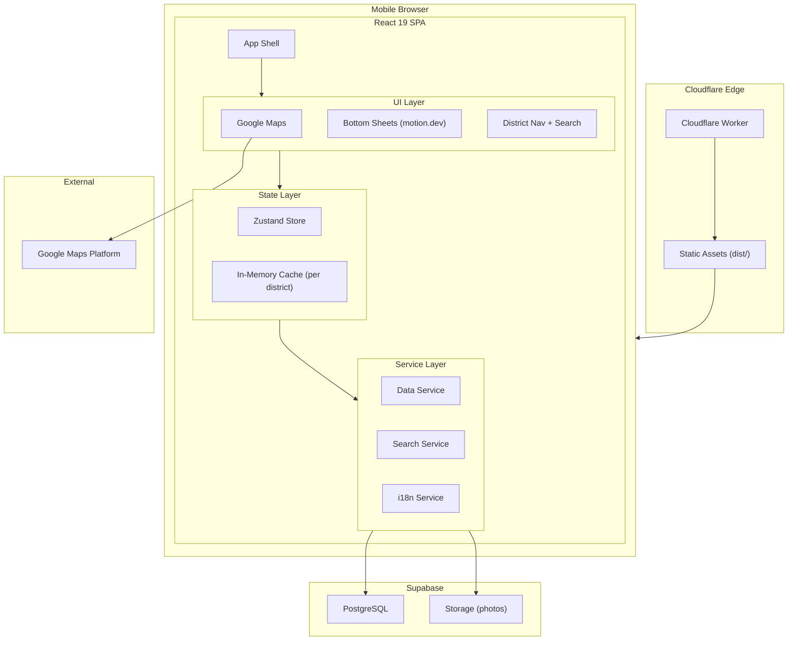

# Logical Components - matzip-map

## Architecture Diagram



## Component Inventory

### Infrastructure Components

| Component | Technology | Purpose |
|-----------|-----------|---------|
| Static Hosting | Cloudflare Workers + Assets | SPA 배포, 글로벌 엣지 |
| Database | Supabase PostgreSQL | 레스토랑, 사진, 메뉴 데이터 |
| File Storage | Supabase Storage | 레스토랑 사진 저장 |
| Map Platform | Google Maps JavaScript API | 지도 렌더링, 마커, 클러스터링 |
| DNS/CDN | Cloudflare | 도메인 관리, 엣지 캐싱 |

### Application Components

| Component | Responsibility | Pattern |
|-----------|---------------|---------|
| Data Service | Supabase 쿼리 추상화 | Repository Pattern (단순화) |
| Search Service | 검색 로직 + debounce | Debounce + Query Builder |
| i18n Service | 언어 감지 + 전환 | Singleton (react-i18next) |
| Store | 전역 상태 관리 | Flux-like (Zustand) |
| Cache | 구역별 레스토랑 캐시 | In-Memory Map |
| Error Boundary | 컴포넌트 크래시 격리 | React Error Boundary |

### UI Components (Logical)

| Component | Pattern | Animation |
|-----------|---------|-----------|
| Map Container | Controlled Component | - |
| Detail Panel | Bottom Sheet | spring (damping: 25) |
| Search Bottom Sheet | Bottom Sheet | spring (damping: 25) |
| Tag Filter Panel | Modal Overlay | fade + slide-up |
| District Nav Bar | Horizontal Scroll | chip tap scale |
| Autocomplete | Dropdown | fade + slide-down |
| Photo Carousel | Swipeable | drag gesture |

## Data Flow Architecture

```
[User Action]
    ↓
[UI Component] → dispatch action
    ↓
[Zustand Store] → update state
    ↓ (if data needed)
[Service Layer] → Supabase query
    ↓
[Supabase] → return data
    ↓
[Store] → cache + update state
    ↓
[UI Component] → re-render
```

## Deployment Architecture

```
Developer
    ↓ npm run build
[Vite] → dist/ (static files)
    ↓ npx wrangler deploy
[Cloudflare Workers]
    ├── worker.ts (entry point)
    └── dist/ (static assets via [assets] config)
         ├── index.html
         ├── assets/
         │   ├── index-[hash].js
         │   └── index-[hash].css
         └── ...
```

## Environment Configuration

```
Production:
  VITE_SUPABASE_URL=https://xxx.supabase.co
  VITE_SUPABASE_ANON_KEY=eyJ...
  VITE_GOOGLE_MAPS_API_KEY=AIza...
  VITE_GOOGLE_MAPS_MAP_ID=xxx

Development:
  Same keys (Supabase free tier shared)
  Google Maps API key with localhost allowed
```

## Monitoring (Minimal)

| What | Where | How |
|------|-------|-----|
| Worker 요청 수 | Cloudflare Dashboard | 자동 |
| DB 쿼리 수/시간 | Supabase Dashboard | 자동 |
| Storage 사용량 | Supabase Dashboard | 자동 |
| Maps API 사용량 | Google Cloud Console | 자동 |
| 에러 | 브라우저 콘솔 | 수동 확인 |
