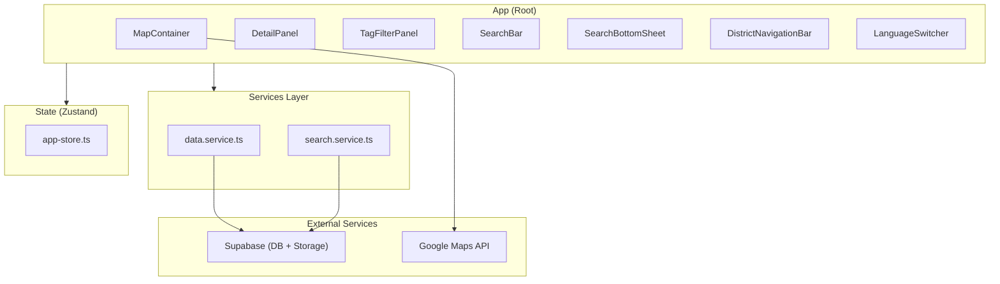

# Application Design - matzip-map

## Component Architecture



## Component Inventory

### Page Components

| Component | Responsibility | State Dependencies |
|-----------|---------------|-------------------|
| App | Root layout, data loading orchestration | activeDistrict, restaurants, language |

### Feature Components

| Component | Responsibility | Props/State |
|-----------|---------------|-------------|
| MapContainer | Google Maps 렌더링, 마커 관리 | activeDistrict, restaurants, selectedTags |
| DetailPanel | 맛집 상세 바텀시트 | selectedRestaurant, language |
| TagFilterPanel | 태그 필터 오버레이 | selectedTags, restaurants |
| SearchBar | 검색 입력 + 자동완성 | searchQuery, language, restaurants |
| SearchBottomSheet | 검색 결과 바텀시트 | searchResults, language |
| DistrictNavigationBar | 구역 선택 칩 바 | activeDistrict, language, districtCounts |
| LanguageSwitcher | 언어 전환 버튼 | language |

### Presentational Components

| Component | Responsibility |
|-----------|---------------|
| PhotoCarousel | 사진 캐러셀 (스와이프) |
| MenuList | 메뉴 목록 (이름 + 가격) |
| RatingDisplay | 평점 표시 (조건부 렌더링) |
| TagBadges | 태그 배지 목록 |
| RestaurantPin | 지도 마커 (색상 코딩) |

## Service Layer

### data.service.ts
```typescript
// Supabase 데이터 조회 서비스
fetchRestaurantsByDistrict(districtId: string): Promise<Restaurant[]>
fetchRestaurantPhotos(restaurantId: string): Promise<RestaurantPhoto[]>
fetchMenuItems(restaurantId: string): Promise<MenuItem[]>
fetchRestaurantCountsByDistrict(): Promise<Record<string, number>>
```

### search.service.ts
```typescript
// 검색 관련 서비스
searchRestaurants(query: string, lang: SupportedLanguage): Promise<Restaurant[]>
getAutocompleteSuggestions(query: string, lang: SupportedLanguage, restaurants: Restaurant[]): SearchSuggestion[]
filterByTags(restaurants: Restaurant[], selectedTags: string[]): Restaurant[]
```

## State Management (Zustand Store)

```typescript
interface AppState {
  // Language
  language: SupportedLanguage;
  
  // Districts
  activeDistrict: string | null;
  districtCounts: Record<string, number>;
  
  // Restaurants
  restaurants: Restaurant[];
  selectedRestaurant: Restaurant | null;
  
  // Tags
  selectedTags: string[];
  isTagFilterOpen: boolean;
  
  // Search
  searchQuery: string;
  searchResults: Restaurant[];
  isSearchBottomSheetOpen: boolean;
  
  // UI
  isDetailPanelOpen: boolean;
  isLoading: boolean;
}
```

### State Interaction Rules
- `setSelectedRestaurant` → 자동으로 DetailPanel 열림, 다른 패널 닫힘
- `setTagFilterOpen(true)` → 자동으로 다른 패널 닫힘
- `setSearchBottomSheetOpen(true)` → 자동으로 다른 패널 닫힘
- 한 번에 하나의 오버레이만 표시 (상호 배타적)

## Data Flow

```
User Action → Store Update → Component Re-render → UI Update
                  ↓
            Service Call (if needed)
                  ↓
            Supabase Query
                  ↓
            Store Update (with data)
                  ↓
            Component Re-render
```

### Key Data Flows

1. **구역 선택**: DistrictNav → setActiveDistrict → fetchRestaurantsByDistrict → setRestaurants → MapContainer re-render
2. **핀 탭**: MapContainer marker click → setSelectedRestaurant → DetailPanel opens
3. **태그 필터**: TagFilterPanel → toggleTag → filterByTags (client-side) → MapContainer re-render
4. **검색**: SearchBar → searchRestaurants (Supabase) → setSearchResults → SearchBottomSheet opens
5. **언어 전환**: LanguageSwitcher → setLanguage + i18n.changeLanguage → All components re-render

## Directory Structure

```
src/
├── components/
│   ├── ui/                    # 공통 UI 컴포넌트
│   ├── MapContainer.tsx       # 지도 + 마커
│   ├── DetailPanel.tsx        # 맛집 상세 바텀시트
│   ├── TagFilterPanel.tsx     # 태그 필터 오버레이
│   ├── SearchBar.tsx          # 검색 + 자동완성
│   ├── SearchBottomSheet.tsx  # 검색 결과
│   ├── DistrictNavigationBar.tsx  # 구역 칩 바
│   ├── LanguageSwitcher.tsx   # 언어 전환
│   ├── PhotoCarousel.tsx      # 사진 캐러셀
│   ├── MenuList.tsx           # 메뉴 목록
│   ├── RatingDisplay.tsx      # 평점 표시
│   ├── TagBadges.tsx          # 태그 배지
│   └── RestaurantPin.tsx      # 마커 컴포넌트
├── constants/
│   ├── districts.ts           # 구역 하드코딩 데이터
│   └── tags.ts                # 태그 하드코딩 데이터
├── services/
│   ├── data.service.ts        # Supabase 데이터 서비스
│   └── search.service.ts      # 검색 서비스
├── store/
│   └── app-store.ts           # Zustand 전역 상태
├── lib/
│   ├── supabase.ts            # Supabase 클라이언트
│   ├── translate.ts           # 번역 헬퍼 함수
│   └── i18n.ts                # i18next 설정
├── types/
│   └── index.ts               # TypeScript 타입 정의
├── locales/
│   ├── en.json                # 영어 UI 텍스트
│   ├── ja.json                # 일본어 UI 텍스트
│   └── zh.json                # 중국어 UI 텍스트
├── App.tsx                    # 루트 컴포넌트
├── main.tsx                   # 엔트리 포인트
└── index.css                  # Tailwind 설정
```
