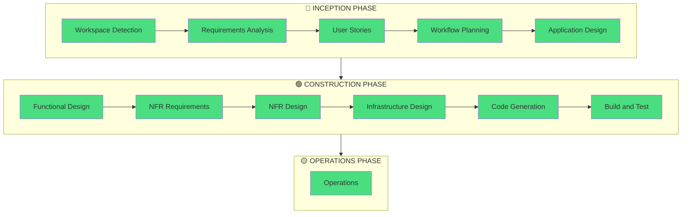

# Workflow Plan - matzip-map

## Project Assessment

| Factor | Assessment |
|--------|-----------|
| Project Type | Greenfield (새 프로젝트) |
| Complexity | Moderate |
| Risk Level | Low (해커톤 프로젝트, 무료 티어) |
| Unit Count | 1 (단일 SPA) |
| User Impact | Direct (외국인 관광객 대상) |

## Phase Execution Plan

## Stage Decisions

### Inception Phase

| Stage | Decision | Depth | Rationale |
|-------|----------|-------|-----------|
| Workspace Detection | ✅ Execute | - | Always required |
| Reverse Engineering | ⏭️ Skip | - | Greenfield project |
| Requirements Analysis | ✅ Execute | Standard | Clear scope, moderate complexity |
| User Stories | ✅ Execute | Standard | Multiple user personas, user-facing app |
| Workflow Planning | ✅ Execute | - | Always required |
| Application Design | ✅ Execute | Standard | New components needed |
| Units Generation | ⏭️ Skip | - | Single unit (monolithic SPA) |

### Construction Phase

| Stage | Decision | Depth | Rationale |
|-------|----------|-------|-----------|
| Functional Design | ✅ Execute | Comprehensive | Complex business rules, multiple entities |
| NFR Requirements | ✅ Execute | Standard | Performance + security considerations |
| NFR Design | ✅ Execute | Standard | Design patterns needed |
| Infrastructure Design | ✅ Execute | Standard | Multi-service architecture |
| Code Generation | ✅ Execute | Comprehensive | Full implementation |
| Build and Test | ✅ Execute | Standard | Build + test instructions |

### Operations Phase

| Stage | Decision | Depth | Rationale |
|-------|----------|-------|-----------|
| Operations | ✅ Execute | Standard | Deployment + monitoring guide |

## Technology Decisions (Pre-determined)

| Decision | Choice | Source |
|----------|--------|--------|
| Map Service | Google Maps | User requirement |
| Hosting | Cloudflare Workers | User requirement |
| Backend | Supabase (BaaS) | Requirements analysis |
| Framework | React 19 | Tech stack decision |
| Language | TypeScript | Tech stack decision |
| Styling | Tailwind CSS 4 | Tech stack decision |
| State | Zustand | Tech stack decision |

## Risk Assessment

| Risk | Probability | Impact | Mitigation | Status |
|------|-------------|--------|------------|--------|
| Google Maps 무료 한도 초과 | Low | Medium | 월 $200 크레딧으로 충분 (28K loads) | ✅ Mitigated |
| Supabase 무료 한도 초과 | Very Low | Medium | 데이터 규모 작음 (~10MB/500MB) | ✅ Mitigated |
| 번역 품질 이슈 | Medium | Low | 수동 검수 + English fallback 전략 | ✅ Mitigated |
| 모바일 성능 이슈 | Low | Medium | Lazy loading + 코드 스플리팅 + 번들 최적화 | ✅ Mitigated |
| 바텀시트 제스처 복잡도 | Medium | Medium | Pointer Events API로 직접 구현, 외부 라이브러리 의존 제거 | ✅ Resolved |
| 지도 마커 대량 렌더링 | Low | Medium | MarkerClusterer로 클러스터링 + 구역별 lazy fetch | ✅ Mitigated |

## Timeline Estimate

| Phase | Estimated Duration |
|-------|-------------------|
| Inception | 2-3시간 |
| Construction (Design) | 3-4시간 |
| Construction (Code) | 4-6시간 |
| Operations | 1시간 |
| **Total** | **10-14시간** |
